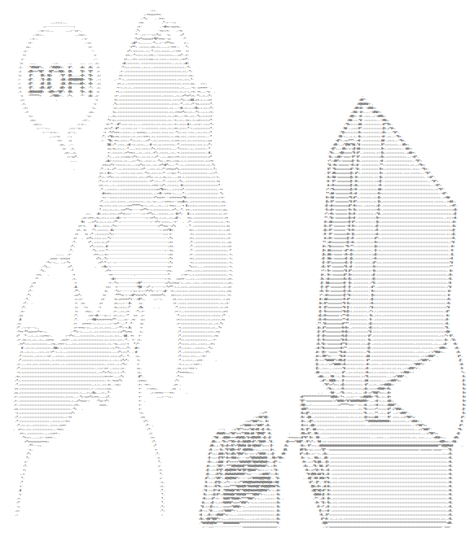

# Image to ASCII Converter
## Overview
This Rust application converts images into ASCII art. It reads an image file, processes it into grayscale, and maps the grayscale values to ASCII characters, creating a text-based representation of the image.

## Features

- Converts images to ASCII art.
- Adjustable output dimensions.
- Supports Docker for easy deployment and testing.

## Requirements

- Rust (for local development and testing)
- Docker (for containerized execution)

## Installation
### Local Setup

1.  Clone the Repository:

```
]$ git clone https://github.com/pedromiguelmiranda/img-to-ascii.git
```

2. Build the Application:

```
]$ cargo build --release
```

3. Run Tests:
```
]$ cargo test --release
```

### Docker Setup

1. Build the Docker Image:
```
]$ docker build -t image_to_ascii_converter .
```

2. Run the Application in Docker:
```
]$ docker run --rm -v $(pwd)/path/to/your/images:/images image_to_ascii_converter --image_path /images/your_image.jpg --width 80 --height 40
```

**Note:**
Replace /path/to/your/images with the path to your images directory.

Replace your_image.jpg with your image file name.
Adjust --width and --height as desired.

## Usage
### Command-Line Options

When running the program, you can specify the following options:

    --image_path: Path to the image file.
    --width: Desired width of the ASCII output.
    --height: Desired height of the ASCII output.

Example command:
```
]$./image_to_ascii_converter --image_path path/to/image.jpg --width 80 --height 40
```

### Using Docker

To run the program with Docker, mount your local image directory to the container and pass the image path relative to the mounted directory:
```
]$ docker run --rm -v $(pwd)/path/to/your/images:/images image_to_ascii_converter --image_path /images/your_image.jpg --width 80 --height 40

```
## Troubleshooting
### Common Issues

- Blurry or Unclear ASCII Art: Adjust the dimensions or the ASCII character set for better contrast.
- Test Failures: Ensure paths are correct and all dependencies are installed.
- Use verbose test output for debugging.

### Improving Clarity

- Adjust the ASCII_CHARS set to use characters that provide better visual distinction.
- Increase contrast before converting to ASCII using image processing techniques.


## Contributing
- Add text generation feature - from text to ascii art


## Contributing

Feel free to submit pull requests or report issues. Contributions to improve the ASCII art conversion or Docker setup are welcome.
License

This project is licensed under the MIT License.